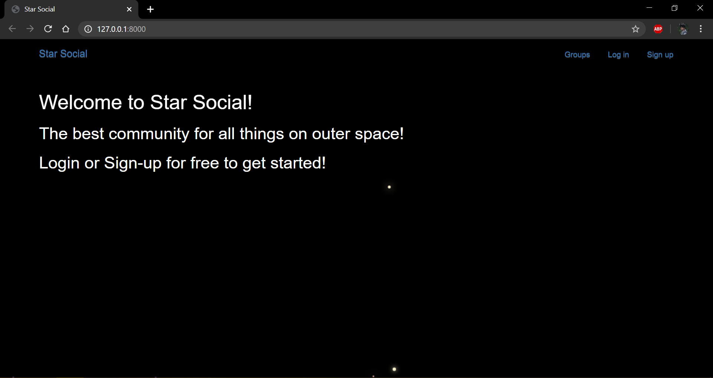

# StarSocial-Django-Application




# Usage
*Clone the repo using ```git clone https://github.com/YuvrajPuyam/StarSocial-Django-Application.git```

*Install the requirements using ```pip install -r requirements.txt``` in your virtual enviroment.

*Run server by using command ```python manage.py runserver```


